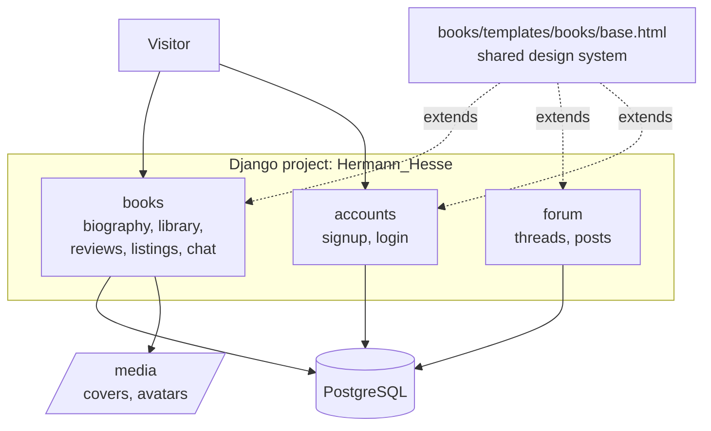
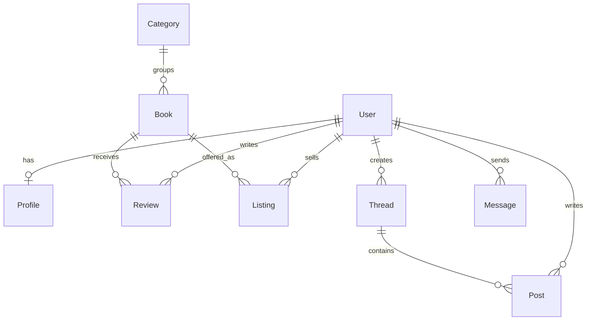
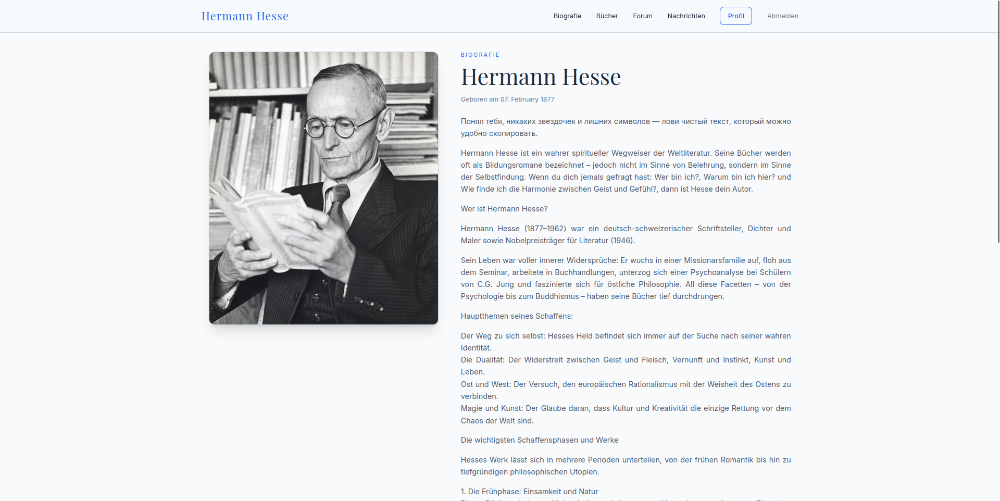
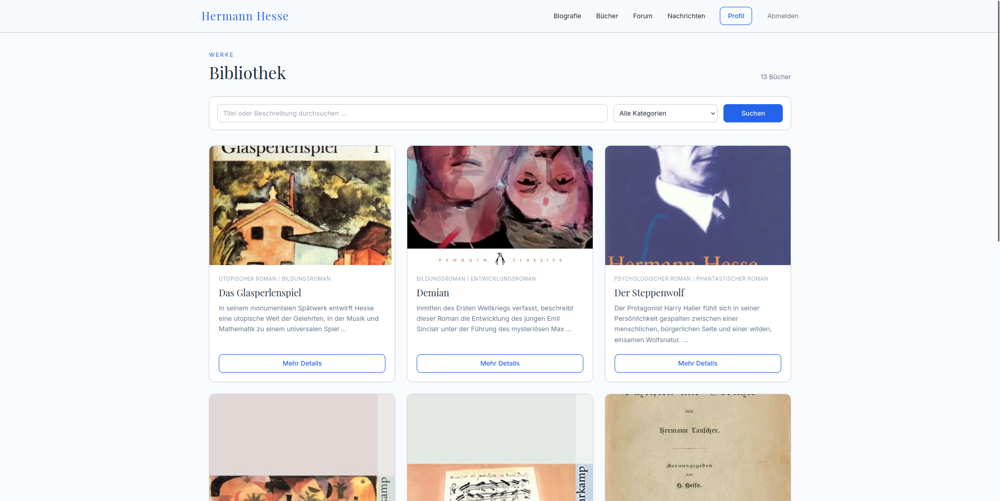
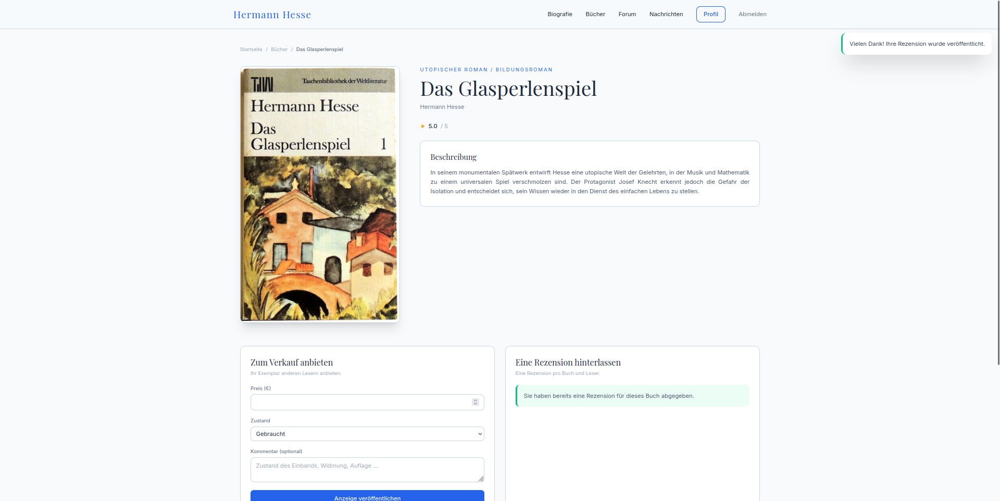
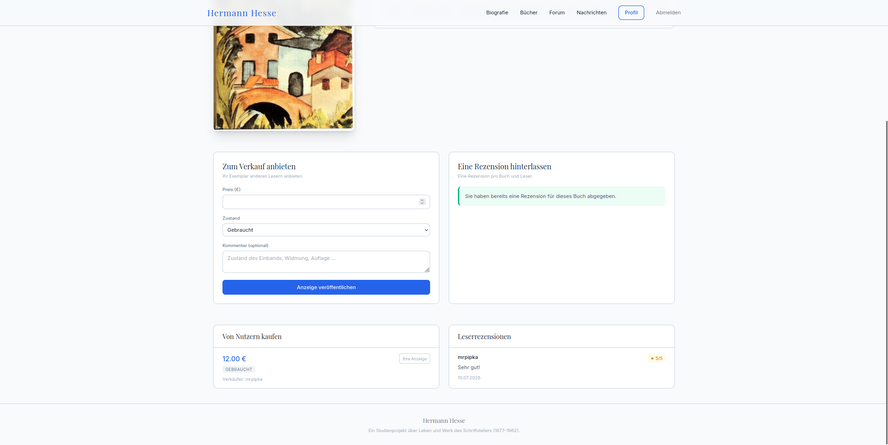
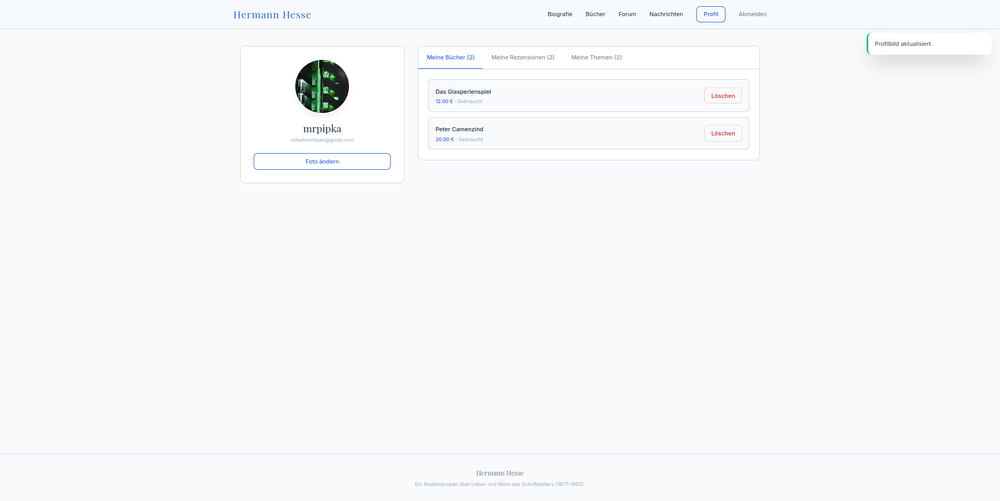
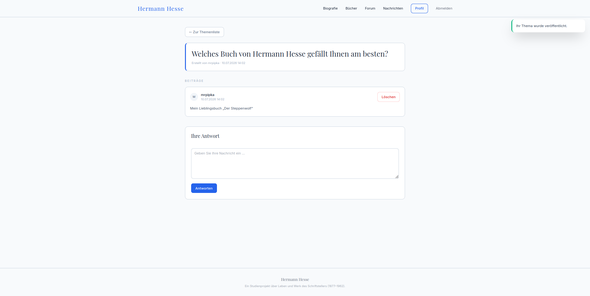

# Hermann Hesse — Literary Community (Django)

A German-language web project dedicated to the writer Hermann Hesse (1877–1962).
Visitors can read his biography, browse the library of his works, and — once
registered — write reviews, offer their own copies for sale, message other
readers, and discuss books in the forum.

Built with **Django 6.0**, **PostgreSQL**, and **Tailwind CSS**.

---

## Features

| Area | What it does |
|---|---|
| **Biography** | Public landing page with the author's portrait and life story |
| **Library** | Public book catalogue with full-text search, category filter and pagination |
| **Reviews** | One review per reader per book (enforced by a DB constraint), 1–5 star rating, average rating per book |
| **Marketplace** | Readers list their own copies (price, condition, comment) |
| **Messaging** | Private 1-to-1 chat with unread-message counter |
| **Forum** | Threads and posts, authors can delete their own contributions |
| **Profile** | Avatar upload, own listings / reviews / threads in tabs |

Public pages: biography, library, book detail.
Everything else requires an account.

---

## Architecture



### Data model



---

## Project layout

```
seitik/
├── Hermann_Hesse/          # settings, root urls, wsgi/asgi
├── accounts/               # signup + styled auth forms
├── books/
│   ├── context_processors.py   # unread message counter
│   ├── migrations/0004_…       # CharField → ForeignKey data migration
│   ├── templates/books/base.html   # design system, all templates extend this
│   └── …
├── forum/
├── templates/registration/ # login.html, signup.html
├── media/                  # user uploads (not in git)
└── manage.py
```

---

## Setup

```bash
git clone <repo-url>
cd <repo>/seitik

python3 -m venv .venv
source .venv/bin/activate
pip install -r ../requirements.txt

cp .env.example .env      # then fill in SECRET_KEY and DB credentials

python manage.py migrate
python manage.py createsuperuser
python manage.py runserver
```

Open http://127.0.0.1:8000/ — the admin lives at `/admin/`.

### Environment variables

All secrets live in `.env` (never committed). See `.env.example`:

| Variable | Purpose |
|---|---|
| `SECRET_KEY` | Django secret key |
| `DEBUG` | `True` in development, `False` in production |
| `ALLOWED_HOSTS` | Comma-separated host list |
| `DB_ENGINE` / `DB_NAME` / `DB_USER` / `DB_PASSWORD` / `DB_HOST` / `DB_PORT` | Database connection |


---


## Tests

```bash
python manage.py test
```

25 tests covering the messaging inbox, the one-review-per-book constraint,
permission checks on the delete endpoints, search and category filtering,
the forum reply flow, and signup validation.

Two of them are regression tests for bugs found during the refactor:
an inbox query that only ever returned outgoing conversations, and an
`UnboundLocalError` triggered by a POST without the expected submit key.

---


## Tech stack

- Django 6.0.1
- PostgreSQL (psycopg2)
- Pillow (image uploads)
- python-dotenv (configuration)
- Tailwind CSS (CDN) — no build step required

## Screenshoots

### Biography


### All books


### View the book



### Profile


### Forum

