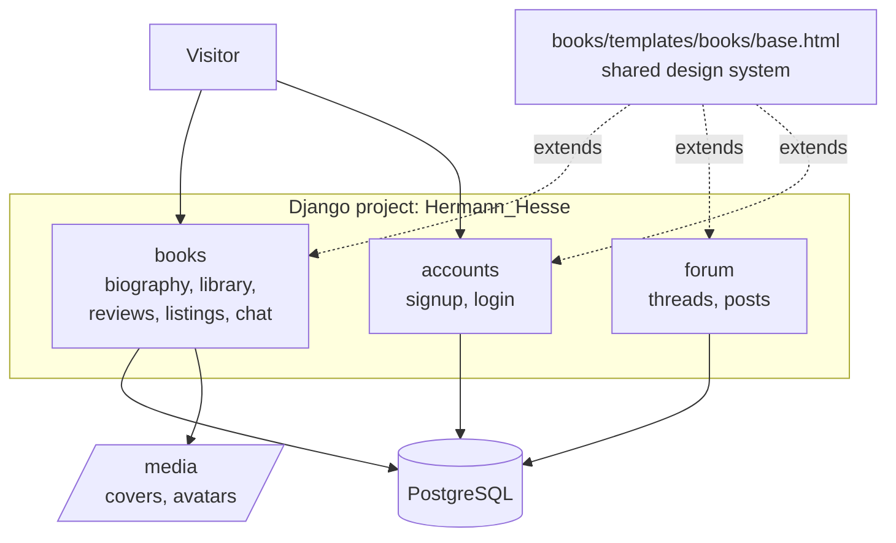
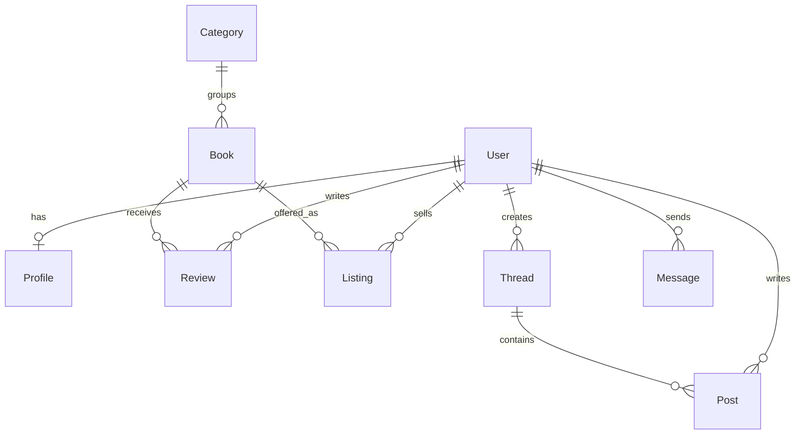

# Hermann Hesse — Literary Community (Django)

A German-language website dedicated to the writer Hermann Hesse (1877–1962).
Visitors can read his biography, browse a catalog of his works, and, after
registering, write reviews, list their own copies for sale, exchange messages with other
readers, and discuss books on the forum.
Users create the catalog content themselves through the admin panel.

Built with **Django 6.0**, **PostgreSQL**, **Docker**, and **Tailwind CSS**.

---

## Features

| Area | What it does |
|---|---|
| **Biography** | Public landing page with the author's portrait and life story |
| **Library** | Public book catalogue with full-text search, category filter and pagination |
| **Reviews** | One review per reader per book (enforced by a DB constraint), 1–5 star rating, average rating per book |
| **Marketplace** | Readers list their own copies (price, condition, comment) |
| **Messaging** | Private 1-to-1 chat with unread-message counter |
| **Forum** | Threads and posts, authors can delete their own contributions |
| **Profile** | Avatar upload, own listings / reviews / threads in tabs |

Public pages: biography, library, book detail.
Everything else requires an account.

---

## Architecture



### Data model



---

## Project layout

```
seitik/
├── Hermann_Hesse/          # settings, root urls, wsgi/asgi
├── accounts/               # signup + styled auth forms
├── books/
│   ├── context_processors.py   # unread message counter
│   ├── migrations/0004_…       # CharField → ForeignKey data migration
│   ├── templates/books/base.html   # design system, all templates extend this
│   └── …
├── forum/
├── templates/registration/ # login.html, signup.html
├── media/                  # uploaded covers and avatars (not in git)
└── manage.py
```

---

## Quick start with Docker (recommended)

The whole stack — web app + PostgreSQL — runs with one command.

```bash
git clone <repo-url>
cd Hermann_Hesse_forum

cp seitik/.env.example seitik/.env    # then fill in the values (see below)
ln -s seitik/.env .env                # let Compose read the same file (see ".env location")

docker compose up --build
```

Then open **http://127.0.0.1:8000**.

On first start the `web` container automatically waits for the database,
applies all migrations and collects static files. Create an admin user in a
second terminal:

```bash
docker compose exec web python manage.py createsuperuser
```

The database starts empty. Log in at `/admin/` and add the biography, book
categories and books yourself. The repository ships without sample book texts
or cover images on purpose — the works of Hermann Hesse are still under
copyright, so the content is left for each deployment to provide.

Everyday commands:

```bash
docker compose up -d          # run in the background
docker compose logs -f web    # follow the logs
docker compose down           # stop (keeps the database)
docker compose down -v        # stop and delete the database volume
```

---

## `.env` location

The project reads configuration from a single `.env` file, but **two tools
look for it in two different places**:

| Tool | Where it looks | Why |
|---|---|---|
| `manage.py` / `runserver` | `seitik/.env` (next to `manage.py`) | `settings.py` calls `load_dotenv(BASE_DIR / '.env')` |
| Docker Compose | `.env` in the repo root (next to `docker-compose.yaml`) | Compose substitutes `${VAR}` in the yaml from there |

To satisfy both without duplicating the file, keep the real file in
`seitik/.env` and symlink the root one to it:

```bash
ln -s seitik/.env .env
```

Now editing `seitik/.env` updates both. The file is git-ignored and never
committed.

### Environment variables

See `seitik/.env.example`:

| Variable | Purpose |
|---|---|
| `SECRET_KEY` | Django secret key (wrap in single quotes — it may contain `$` or `#`) |
| `DEBUG` | `True` in development, `False` in production |
| `ALLOWED_HOSTS` | Comma-separated host list |
| `DB_ENGINE` / `DB_NAME` / `DB_USER` / `DB_PASSWORD` / `DB_HOST` / `DB_PORT` | Database connection |

Generate a fresh secret key:

```bash
python -c "from django.core.management.utils import get_random_secret_key; print(get_random_secret_key())"
```

> **Note on `DB_HOST`.** For local `runserver` it must be `127.0.0.1`.
> Inside Docker the web container reaches PostgreSQL by the service name `db`,
> so `docker-compose.yaml` overrides `DB_HOST: db` for the container — the same
> `.env` therefore works for both.

---


## Local setup without Docker

If you prefer to run the project directly, without containers, you can start it
with a local PostgreSQL server instead:

```bash
cd seitik
python3 -m venv .venv
source .venv/bin/activate
pip install -r ../requirements.txt

cp .env.example .env      # fill in SECRET_KEY and DB credentials; DB_HOST=127.0.0.1

python manage.py migrate
python manage.py createsuperuser
python manage.py runserver
```

This assumes a PostgreSQL server running locally with the credentials from
your `.env`. As with Docker, the database starts empty — add the biography and
books through `/admin/`.

---


## Tests

```bash
python manage.py test
```

25 tests covering the messaging inbox, the one-review-per-book constraint,
permission checks on the delete endpoints, search and category filtering,
the forum reply flow, and signup validation.

Two of them are regression tests for bugs found during the refactor:
an inbox query that only ever returned outgoing conversations, and an
`UnboundLocalError` triggered by a POST without the expected submit key.

---


## Tech stack

- Django 6.0.1
- PostgreSQL (psycopg2)
- Docker & Docker Compose
- gunicorn (WSGI server)
- Pillow (image uploads)
- python-dotenv (configuration)
- Tailwind CSS (CDN) — no build step required

## Screenshots

### Biography


### All books


### View the book


### Profile


### Forum
